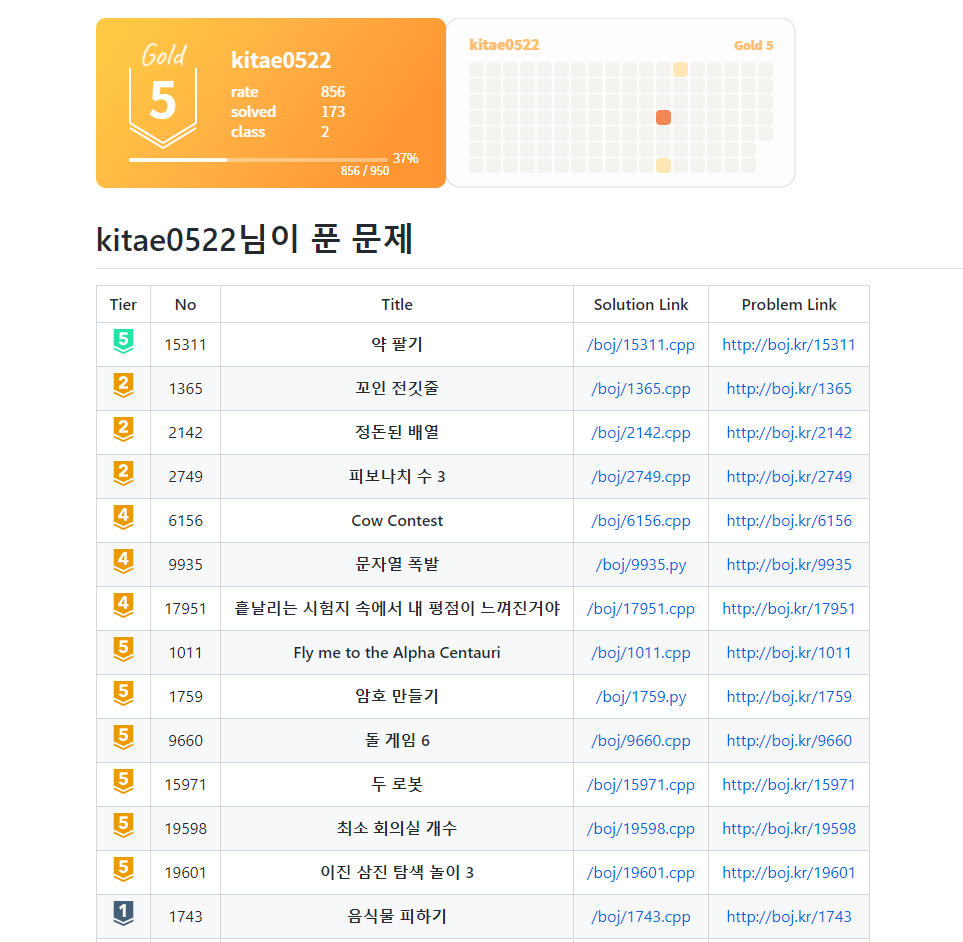

<h1 style="font-weight:600">Make_BOJ_Table</h1>

> '백준'은 프로그래밍 문제를 풀고 온라인으로 채점받을 수 있는 곳입니다.
> 
> 여러분이 풀었던 백준 문제를 필요할 때 다시 찾기 쉽도록, 깔끔하게 표로 관리해보세요.

<h1 style="font-weight:600">Example</h1>
<a href="https://github.com/kitae0522/Online-Problem-Solving"></a>

<h1 style="font-weight:600">Bug report / FeedBack</h1>
<p>이 프로젝트를 이용하다가 생긴 버그나 추가했으면 하는 기능들은 이슈를 남겨주세요.</p>
<p>또한 직접 PR을 넣어주시면 확인 후 반영하겠습니다. 감사합니다.</p>

<h1 style="font-weight:600">Usage</h1>

> ❗ 설치되어 있는 Python이 3.7 버전 이상인지 확인하세요.

1. 이 레포지토리를 Clone하세요.

```bash
$ git clone https://github.com/kitae0522/Make_BOJ_Table.git
```

2. `init.json` 파일을 주석을 참고하여 작성합니다.

```json
{
    "git_name": "", /* 깃허브 계정 아이디 */
    "git_repo": "", /* 해결한 문제 파일이 위치한 깃허브 레포지토리 이름 */
    "boj_name": "" /* 백준 아이디 */
}
```

3. `boj` 디렉터리에 푼 문제 파일을 `(문제 번호).(확장자 명)` 꼴로 작성합니다. (ex. `boj/1000.cpp`)

4. `run.py` 파일을 필요한 옵션에 따라 실행시킵니다.

    - **default (문제 번호를 기준으로 내림차순 정렬)**
    ```bash
    # 1번째 방법
    $ python3 ./run.py

    # 2번째 방법
    $ python3 ./run.py -s p_id -d desc

    # 3번째 방법
    $ python3 ./run.py --sort p_id --direction desc
    ```
    - **option1 (문제 번호를 기준으로 오름차순 정렬)**
    ```bash
    # 1번째 방법
    $ python3 ./run.py -s p_id -d asc

    # 2번째 방법
    $ python3 ./run.py --sort p_id --direction asc
    ```
    - **option2 (문제 티어를 기준으로 내림차순 정렬)**
    ```bash
    # 1번째 방법
    $ python3 ./run.py -s tier -d desc

    # 2번째 방법
    $ python3 ./run.py --sort tier --direction desc
    ```
    - **option3 (문제 티어를 기준으로 오름차순 정렬)**
    ```bash
    # 1번째 방법
    $ python3 ./run.py -s tier -d asc

    # 2번째 방법
    $ python3 ./run.py --sort tier --direction asc
    ```
5. 생성된 `BOJ.md` 파일 명을 `README.md` 파일로 변경 후 커밋 & 푸시합니다.